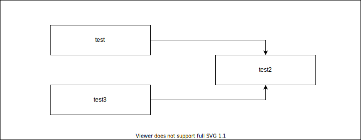

# Diagrams.net(Draw.io)

Diagrams.net(Draw.io)
:   オンライン作図ツール。
    ソースコードは (Jgraph)[https://github.com/jgraph/] で公開されており、
    Diagrams.netでWebサービス (Diagrams.net)[https://www.diagrams.net/] (旧Draw.io)が

Draw.io Integration(hediet.vscode-drawio)
:   [VS Code](/vsocode/01.vscode#vs-code)

## Usage

1.  SVGファイルのファイル名を`*.drawio.svg`で新規作成する。
2.  作成したSVGファイルをVSCode上で開く。
3.  Draw.ioエディターが開くのでSVGファイルを編集する。
4.  編集したファイルは以下のようにMarkdownで表示できる。

    !!! 画像ファイル表示例
        === "Markdown"
            ```markdown
            
            ```

        === "View"
            


