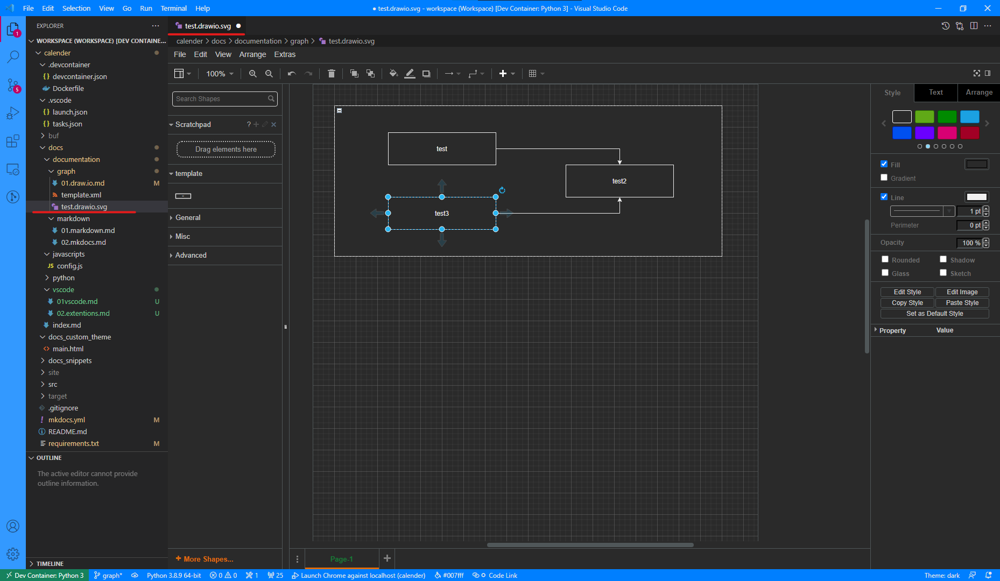
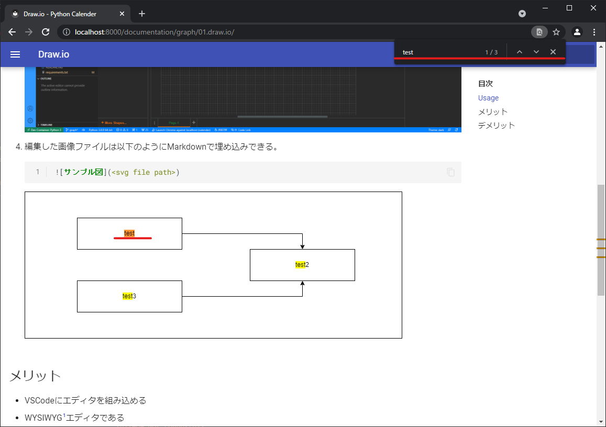

# Draw.io

[Draw.io](https://drawio-app.com/)
:   ドイツのコンサル会社[//SEIBERT/MEDIA](https://seibert-media.com/)が所有する作図ソフトウェア。
    Atlassian社のConfluenceやJira向けのPluginサービスとして収益をあげているらしく、
    draw.io自体はOSSとして[JGraph](https://github.com/jgraph/)で公開されている。
    また[Diagrams.net](https://www.diagrams.net/)(旧Draw.io)でフリーWebサービスとしてホストされている。

Draw.io Integration(hediet.vscode-drawio)
:   VSCode上でオフラインのDraw.ioエディタを利用できるVSCode Extention。
    詳細や設定は[VS Code](/vsocode/01.vscode#vs-code)を参照。

## Usage

1.  SVGファイルのファイル名を`*.drawio.svg`で新規作成する。
2.  作成したSVGファイルをVSCode上で開く。
3.  Draw.ioエディタが開くのでSVGファイルを編集する。

    !!! エディタ例
        

4.  編集した画像ファイルは以下のようにMarkdownで埋め込みできる。

    !!! 画像ファイル埋め込み例
        === "View"
            

        === "Makrdown"
            ```markdown
            
            ```


## メリット

-   VSCodeにエディタを組み込める
-   WYSIWYG[^1]エディタである
-   Excelと比べて高機能な作図機能を利用できる
    -   図形ライブラリやCustom Shape、Scratchpadなどのテンプレート機能
    -   図形のCollapse(折り畳み)やContainer化(入れ子)
    -   オブジェクトData
    -   高度な自動整列機能 Tree
    -   図形検索
        - Draw.ioエディタ上で検索できる
        - SVGファイルをGrep検索できる
        - MarkdownをHTML出力する際にHTML上で検索できる[^2]
          
- テキストファイルとして保存可能でVersion管理に向く
- 学習コストが低い

[^1]: `What You See Is What You Get.`の頭文字で見たままを編集・出力できること。
[^2]: Excel図形は通常の検索できないが、HTMLへのBase64画像埋め込みを用いることでSVG図をブラウザ上で検索可能とする。


## デメリット

- Excelのように文章中に図を挿入する使い方はできない
- SVG(XML)形式なのでテキストとしての可読性はない
